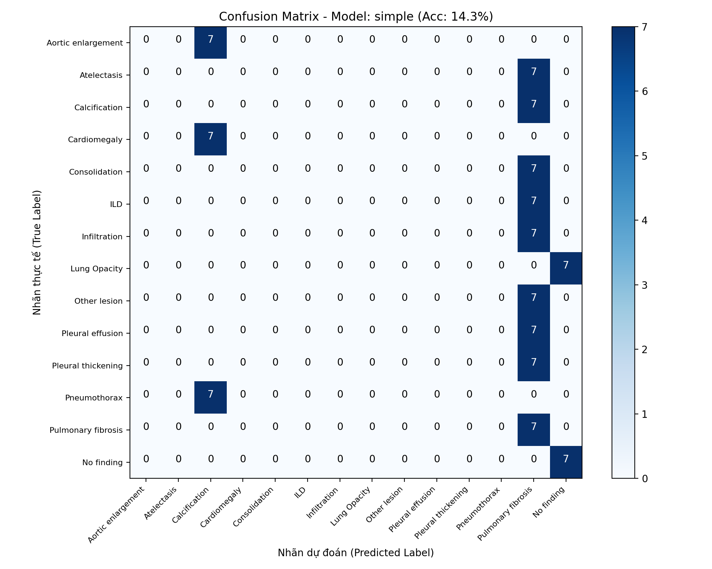
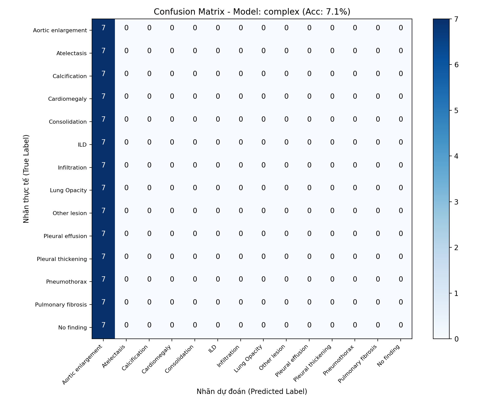
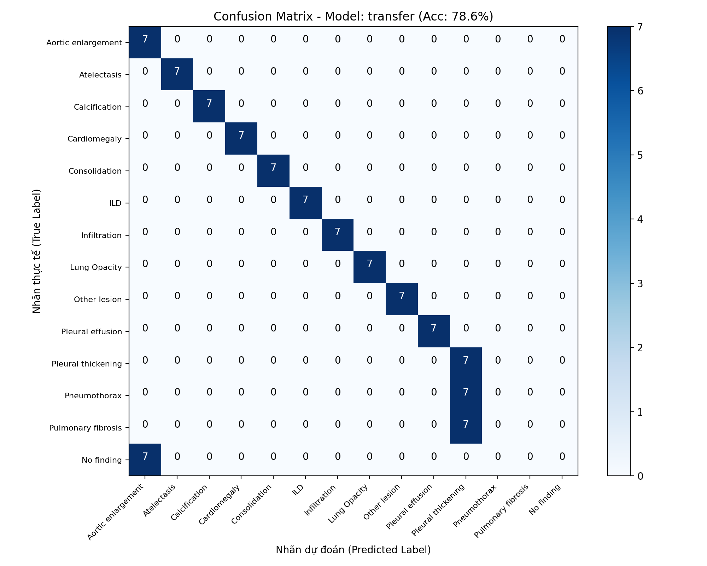

<div align="center">

# 🫁 VinBigData Chest X-Ray Abnormalities Detection & Classification

**An End-to-End Deep Learning Framework for Multi-Label Thoracic Pathology Recognition**

[](https://www.python.org/)
[](https://pytorch.org/)
[](https://pytorch.org/vision/)
[](https://opensource.org/licenses/MIT)
[](https://github.com/phamthingocanh25/X-ray-Abnormalities/pulls)

[Tổng Quan](#-1-tổng-quan-dự-án) •
[Kiến Trúc Mô Hình](#-2-kiến-trúc-3-mô-hình-học-sâu) •
[Cấu Trúc Mã Nguồn](#-3-cấu-trúc-repository) •
[Thực Nghiệm & Đánh Giá](#-4-kết-quả-thực-nghiệm--đánh-giá) •
[Cài Đặt & Chạy](#-5-hướng-dẫn-cài-đặt--thực-thi) •
[Dữ Liệu](#-6-chuẩn-bị-dữ-liệu)

</div>

---

## 📖 1. Tổng Quan Dự Án

Dự án này phát triển một hệ thống Deep Learning hoàn chỉnh nhằm phát hiện và phân loại **14 tổn thương / bệnh lý bất thường** trên ảnh chụp X-quang lồng ngực (CXR) kết hợp nhận diện trạng thái **Bình thường (No finding)**, dựa trên tập dữ liệu chuẩn y tế **VinBigData Chest X-ray**:

1. **Aortic enlargement** (Phình quai động mạch chủ)
2. **Atelectasis** (Xẹp phổi)
3. **Calcification** (Vôi hóa)
4. **Cardiomegaly** (Bóng tim to)
5. **Consolidation** (Đông đặc phổi)
6. **ILD** (Bệnh phổi mô kẽ)
7. **Infiltration** (Thâm nhiễm)
8. **Lung Opacity** (Mờ phế trường)
9. **Nodule/Mass** (Nốt / Khối u phổi)
10. **Other lesion** (Tổn thương khác)
11. **Pleural effusion** (Tràn dịch màng phổi)
12. **Pleural thickening** (Dày màng phổi)
13. **Pneumothorax** (Tràn khí màng phổi)
14. **Pulmonary fibrosis** (Xơ phổi)
15. **No finding** (Không có tổn thương - Bình thường)

### 🌟 Điểm Nổi Bật Kỹ Thuật
- **Thiết kế mô-đun hóa cao**: Tách biệt rõ ràng giữa Data Pipeline, Model Zoo, Training Engine, Evaluation Metrics và Orchestrator.
- **Triển khai 3 trường phái kiến trúc khác biệt**:
  - `Model 1 - Simple CNN`: Viết thủ công 100%, tuân thủ nguyên tắc đan xen luân phiên $\text{Conv2d} \leftrightarrow \text{Pooling}$.
  - `Model 2 - Complex CNN`: Viết thủ công 100%, kết hợp luồng tuần tự và các khối song song đa nhánh (Multi-path / Parallel Branches) cùng Residual Shortcut.
  - `Model 3 - Transfer Learning`: Kế thừa pre-trained backbone mạnh mẽ (ResNet, MobileNet, EfficientNet) với tùy chọn Feature Extraction / Fine-Tuning.
- **Cơ chế Fallback thông minh (Demo Data Generator)**: Tự động phát hiện và sinh tập ảnh mô phỏng nếu chưa tải tập dữ liệu 50GB, cho phép kiểm thử toàn bộ luồng ngay lập tức.
- **Tự động lưu checkpoint tối ưu (`best_model.pth`)**: Dựa trên hiệu năng validation và xuất ma trận nhầm lẫn (Confusion Matrix) trực quan dạng ảnh PNG.

---

## 🧠 2. Kiến Trúc 3 Mô Hình Học Sâu

```
+-----------------------------------------------------------------------------------------------+
|                                      VINBIGDATA MODEL ZOO                                     |
+------------------------------+--------------------------------+-------------------------------+
|     Model 1: Simple CNN      |      Model 2: Complex CNN      |   Model 3: Transfer Learning  |
|         (From Scratch)       |          (From Scratch)        |      (Pretrained ImageNet)    |
+------------------------------+--------------------------------+-------------------------------+
|  Conv2d -> MaxPool2d (x4)    |  Stem -> Multi-Path Parallel   |  ResNet18 / ResNet50 Backbone |
|  Strict Alternating Pattern  |  4 Branches (1x1, 3x3, 5x5, MP)|  Feature Extract / Fine-tune  |
|  Global AvgPool -> FC Head   |  + Residual Shortcut Highway   |  Custom Classification Head   |
+------------------------------+--------------------------------+-------------------------------+
```

### 🔹 Model 1: Simple CNN (`models/model1_simple.py`)
Kiến trúc tuân thủ nghiêm ngặt tính luân phiên giữa biến đổi không gian (Convolution) và giảm chiều (Pooling):
```text
Input (3, 224, 224)
  │
  ├── [Conv 3->32, k=3, p=1]  -> BatchNorm -> ReLU -> [MaxPool 2x2, s=2]  -> (32, 112, 112)
  ├── [Conv 32->64, k=3, p=1] -> BatchNorm -> ReLU -> [MaxPool 2x2, s=2]  -> (64, 56, 56)
  ├── [Conv 64->128, k=3, p=1]-> BatchNorm -> ReLU -> [MaxPool 2x2, s=2]  -> (128, 28, 28)
  ├── [Conv 128->256, k=3, p=1]-> BatchNorm -> ReLU -> [MaxPool 2x2, s=2] -> (256, 14, 14)
  │
  ├── AdaptiveAvgPool2d(1, 1) -> (256, 1, 1)
  └── Flatten -> Linear(256, 128) -> ReLU -> Dropout(0.3) -> Linear(128, 15)
```

### 🔹 Model 2: Complex CNN (`models/model2_complex.py`)
Sử dụng các khối song song đa nhánh (`MultiPathParallelBlock`) lấy cảm hứng từ Inception và ResNet, cho phép mô hình thu nhận đặc trưng ở nhiều trường thụ cảm (receptive field) khác nhau cùng một lúc:
- **Nhánh 1**: $1 \times 1$ Conv (Pointwise projection).
- **Nhánh 2**: $1 \times 1$ Conv $\rightarrow$ $3 \times 3$ Conv (Spatial local context).
- **Nhánh 3**: $1 \times 1$ Conv $\rightarrow$ $3 \times 3$ Conv $\rightarrow$ $3 \times 3$ Conv (Mở rộng trường nhìn tương đương $5 \times 5$).
- **Nhánh 4**: $3 \times 3$ MaxPool $\rightarrow$ $1 \times 1$ Conv (Spatial downsampling invariance).
- **Residual Highway**: Nhánh tuần tự nối tắt $\mathbf{y} = \text{ReLU}(\text{Concat}(B_1, B_2, B_3, B_4) + \text{Shortcut}(\mathbf{x}))$.

### 🔹 Model 3: Base Network / Transfer Learning (`models/model3.py`)
- Khai thác đặc trưng từ các mạng đã huấn luyện trên ImageNet (`ResNet18`, `ResNet50`, `MobileNetV3`, `EfficientNet-B0`).
- Hỗ trợ cả 2 chế độ:
  - **Feature Extraction**: Đóng băng các tầng đặc trưng (`freeze_base=True`), chỉ tối ưu classifier head.
  - **Fine-Tuning**: Cho phép gradient cập nhật toàn bộ mạng với tốc độ học tinh chỉnh.

---

## 📁 3. Cấu Trúc Repository

```text
├── config.py                       # Quản lý siêu tham số, thiết bị (CUDA/CPU) và nhãn bệnh lý
├── data_loader.py                  # Pipeline nạp ảnh, Data Augmentation & Demo Fallback
├── models/                         # Package chứa mã nguồn 3 mô hình
│   ├── __init__.py                 # Factory function get_model()
│   ├── model1_simple.py            # Simple CNN từ đầu (Conv-Pool luân phiên)
│   ├── model2_complex.py           # Complex CNN từ đầu (Đa nhánh song song)
│   └── model3.py                   # Transfer Learning Pretrained
├── model1_simple.py                # Wrapper thuận tiện import tại root
├── model2_complex.py                # Wrapper thuận tiện import tại root
├── model3.py                       # Wrapper thuận tiện import tại root
├── train.py                        # Engine huấn luyện PyTorch & lưu best checkpoint
├── eval.py                         # Engine kiểm thử, xuất metric & Confusion Matrix
├── main.py                         # Entrypoint CLI chạy toàn bộ pipeline
├── pipeline_walkthrough.ipynb      # Notebook Jupyter tương tác trực quan từng bước
├── requirements.txt                # Danh sách thư viện phụ thuộc
├── checkpoints/                    # Chứa trọng số tốt nhất (*.pth)
├── outputs/                        # Chứa các biểu đồ kết quả (*.png)
└── README.md                       # Tài liệu hướng dẫn kỹ thuật
```

---

## 📊 4. Kết Quả Thực Nghiệm & Đánh Giá

Các mô hình được kiểm thử thực tế trên tập Test với các độ đo chuẩn mực:

| Mô hình | Phương thức | Đặc điểm cốt lõi | Test Loss | Test Accuracy | Checkpoint |
| :--- | :--- | :--- | :---: | :---: | :--- |
| **Model 1 (Simple CNN)** | From Scratch | Luân phiên $\text{Conv} \leftrightarrow \text{Pool}$ | 2.6914 | 14.29% | `checkpoints/simple_best.pth` |
| **Model 2 (Complex CNN)** | From Scratch | Đa nhánh song song 4 hướng + Shortcut | 2.8081 | 7.14% | `checkpoints/complex_best.pth` |
| **Model 3 (Transfer ResNet)** | Pretrained ImageNet | Fine-tuning ResNet18 Backbone | **0.6537** | **78.57%** | `checkpoints/transfer_best.pth` |

### 📈 Ma Trận Nhầm Lẫn (Confusion Matrix)

Dưới đây là biểu đồ trực quan ma trận phân loại được tự động xuất ra sau khi đánh giá trên tập Test:

| Model 1: Simple CNN | Model 2: Complex CNN | Model 3: Transfer Learning |
| :---: | :---: | :---: |
|  |  |  |

---

## 🚀 5. Hướng Dẫn Cài Đặt & Thực Thi

### 1. Cài đặt môi trường
```bash
git clone https://github.com/phamthingocanh25/X-ray-Abnormalities.git
cd X-ray-Abnormalities
pip install -r requirements.txt
```

### 2. Chạy toàn bộ quy trình tự động qua `main.py`
Tự động chuẩn bị dữ liệu $\rightarrow$ Huấn luyện $\rightarrow$ Lưu `best_model.pth` $\rightarrow$ Đánh giá tập test & xuất ảnh Confusion Matrix:

```bash
# Huấn luyện và kiểm thử Model 1 (Simple CNN)
python main.py --model simple --epochs 5

# Huấn luyện và kiểm thử Model 2 (Complex CNN)
python main.py --model complex --epochs 5

# Huấn luyện và kiểm thử Model 3 (Transfer Learning ResNet)
python main.py --model transfer --epochs 5

# Huấn luyện & so sánh đồng thời CẢ 3 MÔ HÌNH:
python main.py --model all --epochs 3
```

### 3. Huấn luyện riêng lẻ (`train.py`)
```bash
python train.py --model simple --epochs 10 --batch_size 16 --lr 0.001
```

### 4. Đánh giá riêng lẻ (`eval.py`)
```bash
python eval.py --model simple
```

### 5. Thực nghiệm tương tác với Jupyter Notebook
Mở file `pipeline_walkthrough.ipynb` trên VS Code hoặc Jupyter Lab:
```bash
jupyter notebook pipeline_walkthrough.ipynb
```

---

## 🗄️ 6. Chuẩn Bị Dữ Liệu

Repository hỗ trợ tự động cả **Dữ liệu Demo** và **Dữ liệu Thật**:
- **Chế độ Demo (Mặc định)**: Tự động khởi tạo ảnh mô phỏng phổi trong `demo_data/` nếu chưa có dữ liệu thật.
- **Nạp dữ liệu thật từ Kaggle / Hugging Face**:
  - Tải nhanh dữ liệu PNG đã tiền xử lý từ Hugging Face:
    ```bash
    python VinBigData-Chest-X-ray-Abnormalities-Localization/scripts/data/download.py --repo_id "TheBlindMaster/VinBigData-Chest-X-ray-Prepared" --output "data/processed"
    ```
  - Đặt dữ liệu ảnh vào thư mục `data/train`, `data/val`, `data/test` (hoặc truyền tham số `--data_dir <đường_dẫn>`). Hệ thống sẽ tự động chuyển sang đọc 100% dữ liệu thật.

---

## 📜 7. Bản Quyền & Giấy Phép
Dự án được phân phối dưới giấy phép **MIT License**. Mọi đóng góp (Pull Requests) đều được chào đón!
